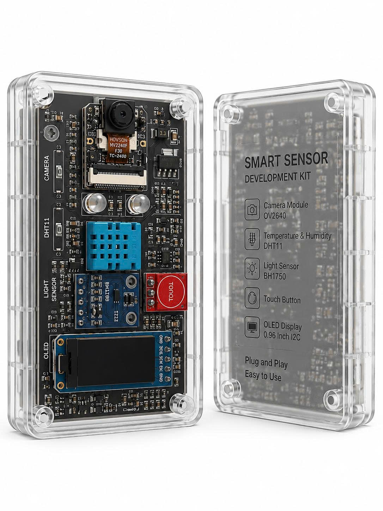

## SmartHome IoT - Hệ Thống Nhà Thông Minh 
## Điều Khiển & Giám Sát Từ Xa 

Dự án nghiên cứu và phát triển hệ thống nhà thông minh tích hợp trí tuệ nhân tạo biên (TinyML) sử dụng vi điều khiển **Seeed Studio XIAO ESP32S3**, giao thức **MQTT** và giao diện điều khiển **Web Dashboard** thời gian thực.

---

## 📌 Tổng Quan Hệ Thống

Hệ thống cho phép giám sát các chỉ số môi trường (nhiệt độ, độ ẩm, ánh sáng) và điều khiển các thiết bị trong nhà (đèn, cửa) từ xa thông qua giao diện Web. Đặc biệt, hệ thống tích hợp mô hình Học Máy biên (TinyML) của **Edge Impulse** chạy trực tiếp trên ESP32S3 để nhận dạng từ khóa giọng nói ngoại tuyến (offline voice keywords) nhằm điều khiển thiết bị mà không cần kết nối Internet.

## ✨ Các Tính Năng Nổi Bật

- **Giám sát thời gian thực:** Cập nhật liên tục nhiệt độ, độ ẩm và cường độ ánh sáng bằng biểu đồ sinh động qua Chart.js.
- **Điều khiển từ xa thông minh:** Bật/tắt đèn và đóng/mở cửa từ Web Dashboard với độ trễ cực thấp (< 100ms) qua MQTT.
- **Trí tuệ nhân tạo biên (TinyML):** Nhận diện từ khóa giọng nói trực tiếp trên chip ESP32S3 để thực thi các lệnh điều khiển nhanh chóng.
- **Cấu hình WiFi tiện lợi:** Tích hợp `WiFiManager` giúp kết nối phần cứng vào mạng WiFi gia đình dễ dàng thông qua cổng cấu hình Captive Portal mà không cần nạp lại code.
- **Đồng bộ ngưỡng thông minh:** Thiết lập ngưỡng tự động tắt/bật thiết bị (nhiệt độ, độ ẩm, ánh sáng) từ giao diện Web và đồng bộ trực tiếp xuống phần cứng.
- **Giao diện hiện đại & Modular:** Thiết kế giao diện Premium Glassmorphism, Responsive (tương thích Mobile/Tablet) và sử dụng kiến trúc ES Modules sạch sẽ.

---

## 🛠️ Chi Tiết Phần Cứng (Hardware)

Dự án sử dụng các linh kiện phần cứng sau:
*   **Vi điều khiển chính:** Seeed Studio XIAO ESP32S3 (Lõi kép, hỗ trợ WiFi, Bluetooth và tăng tốc tính toán AI).
*   **Cảm biến nhiệt độ & độ ẩm:** DHT22 (Độ chính xác cao).
*   **Cảm biến ánh sáng:** BH1750 (Giao tiếp I2C, đo cường độ Lux chính xác).
*   **Màn hình hiển thị:** OLED SSD1306 (128x64 pixels, giao tiếp I2C).
*   **Cơ cấu chấp hành:** Module Relay 4 kênh để đóng cắt thiết bị điện 220V.
*   **Mô hình AI:** Tích hợp bộ thư viện `Edge Impulse SDK` đã được huấn luyện nhận diện từ khóa giọng nói.

*Mã nguồn phần cứng nằm tại thư mục:* `Phan_Cung/IoT_Ung_Dung/` (dự án dạng **PlatformIO**).

---

## 💻 Chi Tiết Phần Mềm (Software)

Mã nguồn phần mềm được chia làm hai phần chính tại thư mục `Phan_Mem/`:

### 1. Front-End (`Phan_Mem/Front_End/`)
Được thiết kế theo phong cách hiện đại với giao diện Glassmorphism, Responsive hoàn toàn và sử dụng kiến trúc ES Modules (Vanilla JS & CSS).
*   **`ladingpage.html`**: Trang giới thiệu dự án (Landing Page) siêu nhẹ (< 40 dòng), đóng vai trò điều hướng.
*   **`index.html`**: Trang Dashboard chính hiển thị các biểu đồ, widget điều khiển thiết bị và terminal.
*   **`css/`**: Chứa các file style modular hóa:
    *   `variables.css`: Khai báo bảng màu HSL, typography (Outfit font) và thiết kế hệ thống.
    *   `landingpage.css`: Toàn bộ giao diện động của Landing Page.
    *   `metrics.css`, `devices-grid.css`, `serial-terminal.css`...: CSS riêng biệt cho từng thành phần trong Dashboard.
*   **`js/`**:
    *   `app/main.js`: File khởi tạo và phối hợp các module của Dashboard.
    *   `app/landingpage.js`: Điều phối hiệu ứng và hành động trên trang Landing Page.
    *   `templates/`: Các thành phần giao diện (UI Components) được viết dưới dạng hàm JavaScript ES Module xuất HTML trực tiếp.
    *   `connection/`: Quản lý kết nối MQTT WebSockets từ trình duyệt tới broker công cộng và ESP32.

### 2. Back-End API (`Phan_Mem/Back_End/`)
Xây dựng trên nền tảng **Node.js** và **Express**, sử dụng database **MongoDB** làm nơi lưu trữ dữ liệu lịch sử cảm biến từ thiết bị.
*   **`server.js`**: Điểm khởi chạy máy chủ Express và khởi chạy MQTT Listener.
*   **`services/mqttListener.js`**: Lắng nghe liên tục topic `iot_ung_dung/team_2/sensor/#` từ MQTT Broker (`broker.emqx.io`), tự động đăng ký thiết bị mới vào database khi nhận bản tin đầu tiên và lưu trữ nhật ký cảm biến theo thời gian thực.
*   **`routes/`**:
    *   `auth.js`: Đăng ký, đăng nhập và xác thực người dùng sử dụng mã hóa `bcryptjs` và Token `JWT`.
    *   `sensors.js`: Cung cấp API truy vấn lịch sử chỉ số cảm biến (`/api/sensors/history`) vẽ biểu đồ Chart.js và chỉ số mới nhất (`/api/sensors/latest`).
    *   `devices.js`: API quản lý danh sách thiết bị thông minh kết nối vào mạng lưới.
*   **`models/`**: Khai báo cấu trúc Schema (Mongoose) lưu trữ thông tin thiết bị (`Device`) và nhật ký cảm biến (`SensorLog`).

---

## 🚀 Hướng Dẫn Cài Đặt & Khởi Chạy

### Yêu Cầu Hệ Thống
*   Đã cài đặt **Node.js** (Phiên bản gợi ý: >= v16).
*   Đã cài đặt và đang chạy dịch vụ **MongoDB** tại máy cục bộ (hoặc sử dụng URI kết nối Cloud MongoDB Atlas).

### 1. Nạp Code Phần Cứng (ESP32S3)
1. Cài đặt extension **PlatformIO IDE** trên VS Code.
2. Mở thư mục dự án phần cứng tại `Phan_Cung/IoT_Ung_Dung/`.
3. Kết nối board **Seeed Studio XIAO ESP32S3** với máy tính qua cổng USB-C.
4. Nhấn **Build** và **Upload** code từ thanh công cụ PlatformIO để nạp chương trình.
5. Khi khởi động lần đầu, thiết bị sẽ phát ra một điểm truy cập WiFi mang tên cấu hình. Sử dụng điện thoại/máy tính kết nối vào đó, một trang Captive Portal sẽ hiển thị để bạn cấu hình mạng WiFi và mật khẩu cho ESP32.

### 2. Khởi Chạy Hệ Thống Phần Mềm

#### Cách 1: Khởi chạy nhanh bằng Script tự động (Khuyên Dùng)
Nếu bạn đang chạy hệ điều hành Windows, dự án đã cung cấp một tệp tin Batch để khởi động toàn bộ dịch vụ chỉ bằng một cú click:
1. Đảm bảo dịch vụ MongoDB cục bộ của bạn đã được khởi động ở cổng mặc định (`27017`).
2. Mở thư mục `RUN/` và nhấp đúp vào tệp tin **`run.bat`**.
3. Tệp script sẽ tự động mở hai cửa sổ dòng lệnh riêng biệt để chạy Back-End (`port 5000`) và Front-End (`port 3000`), sau đó tự động mở trình duyệt web hiển thị Landing Page.

#### Cách 2: Khởi chạy thủ công từng phần

*   **Bước 2.1: Cấu hình và chạy Back-End API**
    1. Di chuyển vào thư mục backend:
       ```bash
       cd Phan_Mem/Back_End
       ```
    2. Cài đặt các thư viện phụ thuộc:
       ```bash
       npm install
       ```
    3. Tạo tệp `.env` trong thư mục `Phan_Mem/Back_End/` và điền cấu hình cơ bản sau:
       ```env
       PORT=5000
       MONGO_URI=mongodb://localhost:27017/smarthome
       MQTT_BROKER_URL=mqtt://broker.emqx.io:1883
       JWT_SECRET=smarthome_super_secret_key_123
       ```
    4. Khởi chạy máy chủ:
       - Chế độ Production: `npm start`
       - Chế độ Development (tự tải lại khi lưu code): `npm run dev`

*   **Bước 2.2: Khởi chạy Front-End**
    1. Di chuyển vào thư mục frontend:
       ```bash
       cd Phan_Mem/Front_End
       ```
    2. Sử dụng trình chạy HTTP Server tĩnh bất kỳ (ví dụ như `http-server` của npm):
       ```bash
       npx http-server -p 3000
       ```
    3. Mở trình duyệt web của bạn và truy cập địa chỉ: `http://localhost:3000/ladingpage.html`.
### 3. Kết Nối Phần Mềm & Phần Cứng
1. Lấy **địa chỉ IP** của ESP32 hiển thị trên màn hình OLED (hoặc qua log Serial).
2. Nhấn vào nút **Trải Nghiệm Ngay** trên Landing Page để chuyển sang Dashboard.
3. Nhập địa chỉ IP của thiết bị vào ô kết nối trên Dashboard.
4. Giao diện Web sẽ tự động thiết lập kết nối MQTT thông qua EMQX Broker đến thiết bị và bắt đầu cập nhật dữ liệu liên tục!

---

## 👥 Đội Ngũ Phát Triển (Team Rách)

Dự án được xây dựng và hoàn thiện bởi các thành viên **Team Rách** thuộc môn học **IoT và Ứng Dụng**. 
Chúc bạn có những trải nghiệm tuyệt vời với **SmartHome IoT**! 🏡⚡

## Trưởng đoàn : Lê Chí Hiếu - 0329675925
## Các thành viên tham gia
### 01. Ngô Quý Trường Giang 
### 02. Trần Huy Hoàng 
### 03. Trần Quốc Khánh
### 04. Bùi Văn Sang
### 05. Phá Đoàn : Nguyễn Thị Ngọc Anh
### 06. Bình Luận Viên : Nguyễn Tất Thắng

# Hình ảnh thương mại


# Bảng lệnh Help
``` Help
Danh sách lệnh hợp lệ:
- LED_ON : Bật đèn phòng khách
- LED_OFF : Tắt đèn phòng khách
- GET_TEMP : Lấy nhiệt độ hiện tại
- GET_IP : Lấy địa chỉ IP kết nối
- REBOOT : Khởi động lại vi điều khiển
```